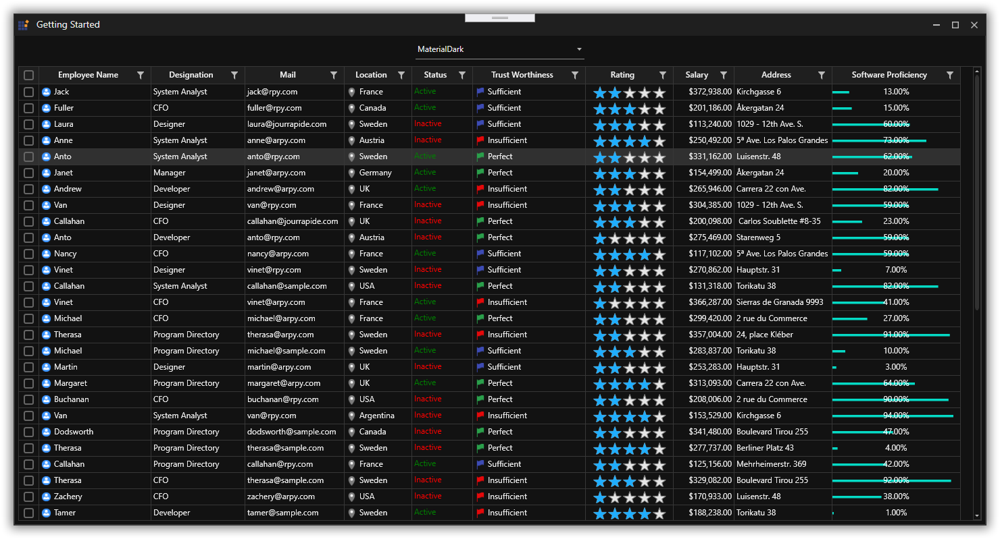

# How to change themes at run time using SkinManager?

This sample loads [Datagrid](https://help.syncfusion.com/wpf/datagrid/getting-started) and [Chromeless Window](https://help.syncfusion.com/wpf/chromeless-window/getting-started) with `MaterialDark` theme look which has been applied using SkinManager [VisualStyle](https://help.syncfusion.com/wpf/themes/skin-manager#set-visual-style) property. Also, it provides drop down options using [ComboBox](https://docs.microsoft.com/en-us/dotnet/api/system.windows.controls.combobox?view=netcore-3.1) to change themes at run time.

