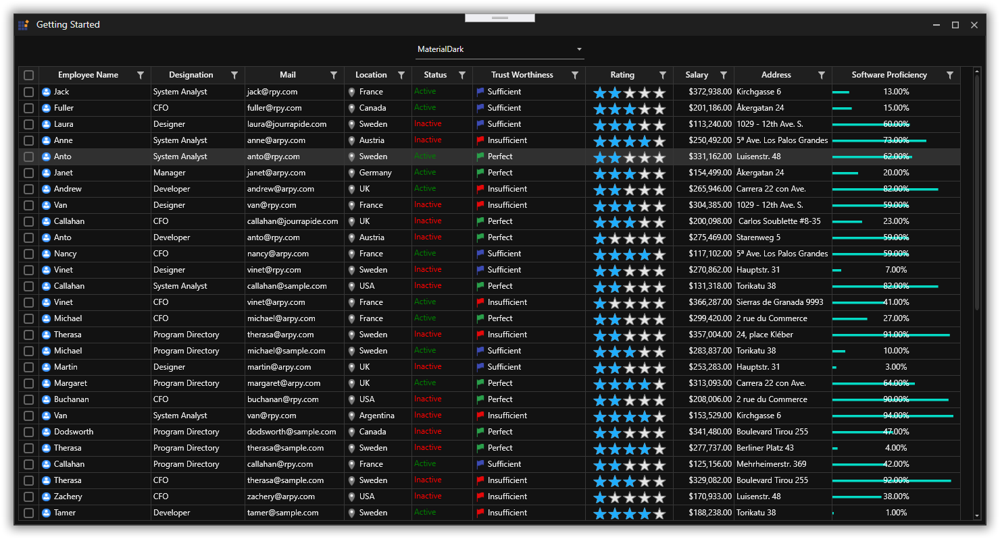

# How to change themes at run time using SkinManager?

This sample demonstrates dynamic theme switching at runtime using Syncfusion's SkinManager in WPF applications.

# Overview

The application showcases:

* [Datagrid](https://help.syncfusion.com/wpf/datagrid/getting-started) with MaterialDark theme applied by default
* [Chromeless Window](https://help.syncfusion.com/wpf/chromeless-window/getting-started) for modern borderless UI
* Runtime theme switching via dropdown [ComboBox](https://learn.microsoft.com/en-us/dotnet/api/system.windows.controls.combobox?view=windowsdesktop-10.0)
* Multiple theme options (Material, Office2019, Fluent, etc.)

Themes are applied using SkinManager's [VisualStyle](https://help.syncfusion.com/wpf/themes/skin-manager#set-visual-style) property, enabling seamless theme changes without application restart.

# Features

* Pre-loaded MaterialDark theme on startup
* ComboBox control for theme selection
* Instant theme switching across all Syncfusion controls
* Support for multiple built-in themes
* Chromeless window with custom theming
* DataGrid with theme-aware styling

# Prerequisites

* Visual Studio 2019 or later
* .NET Framework 4.6+ or .NET 8.0+
* Syncfusion Essential Studio for WPF

# Quick Start

* Clone the repository
* Open solution in Visual Studio
* Restore NuGet packages
* Run the application
* Use the dropdown to switch themes

# Theme Options

* MaterialLight / MaterialDark
* Office2019Colorful / Office2019Black
* FluentLight / FluentDark